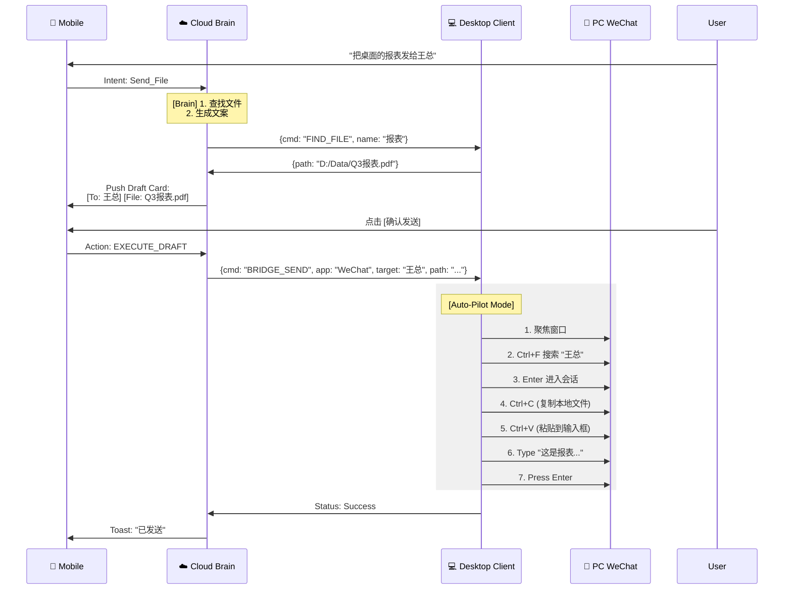

# 🏗️ Project Neural Link: 系统架构文档 v1.2

| 文档属性 | 内容 |
| --- | --- |
| **版本** | **v1.2 (The Bridge Architecture)** |
| **对应 PRD** | [PRD v1.3] |
| **核心变更** | 1. 新增 **Desktop Bridge** 层 (GUI 自动化)。<br>

<br>2. 定义 **权限提权** 协议。<br>

<br>3. 优化 **Draft-to-Action** 状态机。 |

---

## 1. 高层架构图 (High-Level Architecture)

我们依然保持 "Cloud Brain + Local Hands" 的大格局，但 "Local Hands" 现在进化了。

```mermaid
graph TD
    subgraph "Mobile (Controller)"
        App[📱 Neural Link App]
        DraftUI[📝 Draft Confirm UI]
    end

    subgraph "Cloud (Brain)"
        Gateway[🛡️ WSS Gateway]
        Planner[🧠 Intent Planner]
        BridgeRouter[🔀 Bridge Router]
    end

    subgraph "Desktop (Executor)"
        NodeClient[🤖 Ghost Client (Node.js)]
        
        subgraph "Internal Modules"
            ShellMod[💻 Shell Exec]
            FileMod[📂 File IO]
            BridgeMod[🔌 Desktop Bridge]
        end
    end

    subgraph "Target Apps (Parasitic Targets)"
        WeChat[💬 WeChat / Slack]
        Browser[🌐 Chrome]
    end

    App <-->|WSS| Gateway
    Gateway <-->|WSS| NodeClient
    
    NodeClient --> ShellMod
    NodeClient --> FileMod
    NodeClient --> BridgeMod
    
    BridgeMod -.->|Accessibility / HID| WeChat
    BridgeMod -.->|Accessibility / HID| Browser

```

---

## 2. 核心组件详解：Desktop Bridge

这是实现“社交镜像”和“远程发微信”的关键技术栈。

### 2.1 技术选型 (Tech Stack)

为了保持客户端轻量（单文件 Node 二进制），我们拒绝庞大的 Python RPA 库，采用 **Native Node Addons + OS Scripts**。

| 功能 | Windows 实现方案 | macOS 实现方案 | 备注 |
| --- | --- | --- | --- |
| **窗口聚焦** | `user32.dll` (FFI) / PowerShell | AppleScript (`tell application...`) | 确保微信窗口在前台 |
| **读取消息** | **UI Automation API** (win32) | **Accessibility API** (AX) | 相比 OCR 更快、更准 |
| **模拟输入** | `SendInput` (WinAPI) | `CGEventCreateKeyboardEvent` | 模拟 Ctrl+V 和 Enter |
| **文件拖拽** | OLE Drag&Drop (难点) | AppleScript / Clipboard | 优先使用“复制文件 -> 粘贴”路径 |

### 2.2 桥接模块接口 (Bridge Interface)

桌面端暴露给云端的标准 JSON 接口：

```typescript
interface IBridgeCommand {
  type: 'BRIDGE_ACTION';
  app: 'WeChat' | 'Slack' | 'Global';
  action: 'READ_LAST_MSG' | 'SEND_TEXT' | 'SEND_FILE';
  payload: any;
}

// 示例：向微信发送文件
const cmd = {
  type: 'BRIDGE_ACTION',
  app: 'WeChat',
  action: 'SEND_FILE',
  payload: {
    target_user: '王总', // 需先通过搜索聚焦联系人
    file_path: 'C:\\Users\\Admin\\Desktop\\Q3.pdf',
    caption: '王总请过目'
  }
}

```

---

## 3. 交互时序图 (Interaction Flows)

### 3.1 远程发微信 (The "Remote Draft" Flow)

这是 PRD v1.3 中定义的“第二屏”核心逻辑。



---

## 4. 权限与安全 (Security & Permissions)

### 4.1 引导式提权 (Guided Escalation)

为了解决 PRD v1.3 提到的“权限欺诈”问题，我们设计了 **Lazy Elevation** 机制。

* **默认状态 (User Mode):**
* 客户端以当前用户权限启动。
* 能力：读写 `~/Documents`，操作 GUI (因为是同级用户进程)。
* 限制：无法 `pip install -g`，无法读系统盘。


* **提权流程:**
1. 当云端下发指令包含 `sudo` 或高权操作时。
2. Node 客户端捕获 `EACCES` (Permission Denied) 错误。
3. Node 客户端使用 `sudo-prompt` (跨平台库) 弹出一个原生 OS 对话框。
4. **UI 显示:** "Neural Link Client 想要进行更改。原因：执行修复脚本。"
5. 用户在电脑前输入密码 / 点击是。
6. 客户端重启自身或创建一个高权子进程 (Child Process) 来执行命令。


### 4.2 视觉审计 (Visual Audit)

由于我们现在操作 GUI，存在“乱点”风险。

* **屏幕高亮:** 当 Bridge 开始操作时，桌面端会在屏幕边缘渲染一圈 **绿色边框**，提示用户“AI 正在控制”。
* **紧急中断:** 用户晃动鼠标或按下 `Esc`，立即终止所有自动化操作 (Kill Switch)。

---

## 5. 数据结构更新 (Schema Update)

### 5.1 `drafts` (草稿表)

草稿不仅是文字，现在包含了极其复杂的“动作上下文”。

```sql
CREATE TABLE drafts (
    draft_id UUID PRIMARY KEY,
    user_id UUID,
    status VARCHAR(20), -- 'PENDING', 'EXECUTED', 'CANCELLED'
    
    -- 核心：Action Payload
    target_app VARCHAR(50), -- 'WeChat'
    target_window_title VARCHAR(100), -- '王总'
    
    content_text TEXT,
    attachment_path TEXT, -- 本地绝对路径 (不上传云端，只传路径)
    
    created_at TIMESTAMP,
    expires_at TIMESTAMP -- 草稿 5分钟后过期
);

```

---

## 6. 开发实施建议 (Implementation Strategy)

作为架构师，我建议开发团队按以下步骤推进：

1. **Step 1: The "Eye" (读取能力):**
* 先实现读取 PC 版微信当前聊天窗口的最后一条消息。
* 技术验证：在 Windows 使用 `UIAutomation`，在 Mac 使用 `JXA`。


2. **Step 2: The "Hand" (输入能力):**
* 实现稳定的 `Copy File` -> `Paste` 流程。这是发送文件最兼容的方式。


3. **Step 3: The "Brain" (路由逻辑):**
* 后端实现 `Draft` 状态机，确保用户不在手机点确认，电脑绝不乱动。


---
